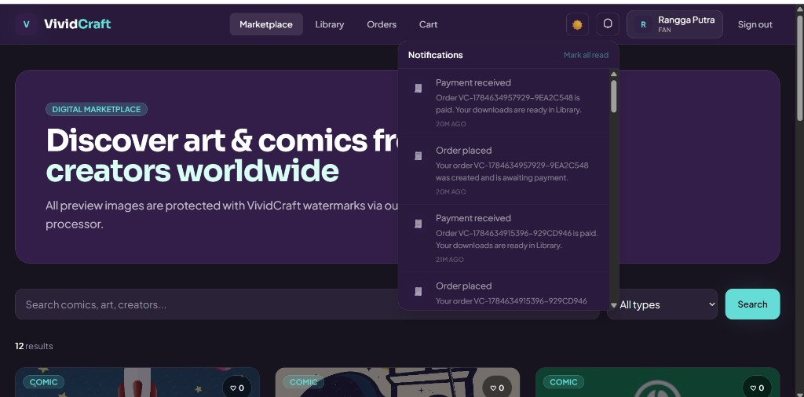
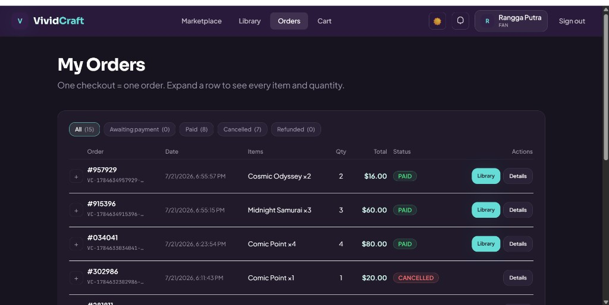
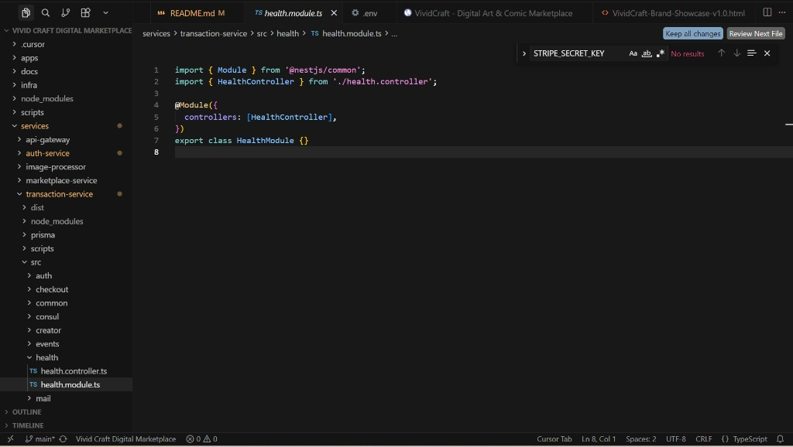
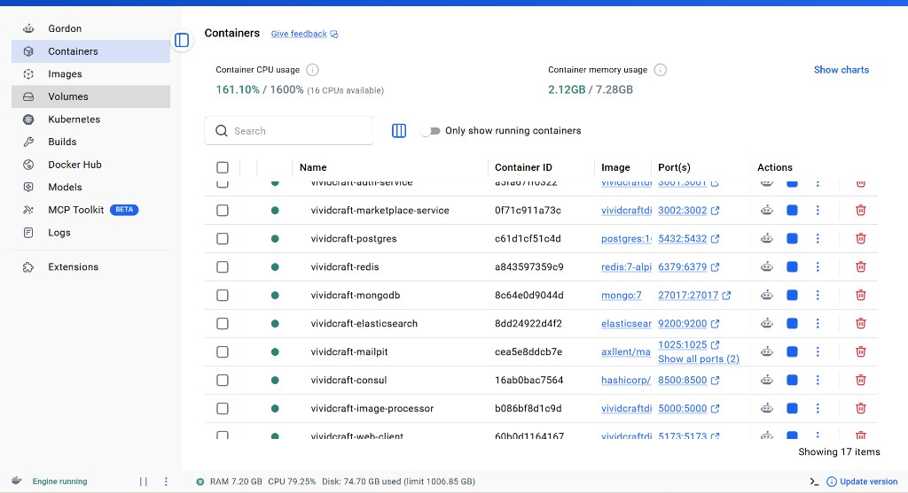
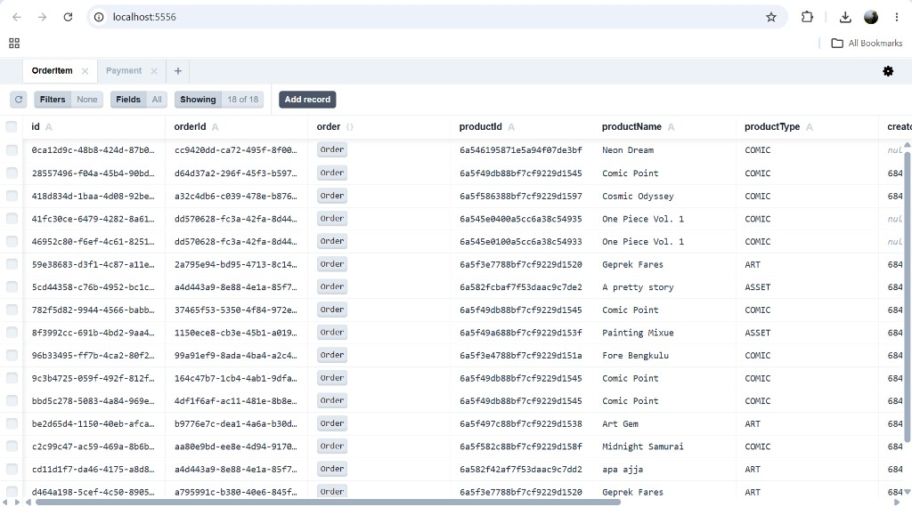

# VividCraft — Platform Preview

Visual walkthrough of the marketplace, infrastructure, and dev tooling. Use this doc for portfolio reviewers, recruiters, or teammates who want a quick look before running the stack locally.

> **IDE preview:** If images look blank in Cursor/VS Code, reload the window after opening this repo (workspace setting allows local images). On **GitHub**, images render automatically.

---

## Marketplace & notifications

Browse comics, art, and assets. Live payment notifications via SSE (no polling).

---

## My Orders

Table view with status filters (All · Awaiting payment · Paid · Cancelled · Refunded), pagination, and expandable line-item details.

---

## Microservices codebase

Monorepo layout: `apps/web-client`, `services/*` (auth, marketplace, transaction, api-gateway, image-processor), shared `docs/` and `infra/`.

---

## Docker stack

All services run via Docker Compose — gateway, NestJS microservices, Postgres, MongoDB, Redis, Elasticsearch, Mailpit, Consul, and the React web client.

---

## Prisma Studio (transactions DB)

Inspect orders, order items, payments, and related tables at http://localhost:5556.

---

## Related dev UIs

| Tool | URL |
|------|-----|
| Web app | http://localhost:5173 |
| Redis Commander | http://localhost:8081 |
| Prisma Studio (auth) | http://localhost:5555 |
| Prisma Studio (transactions) | http://localhost:5556 |
| Mailpit | http://localhost:8025 |
| API Swagger | http://localhost:3000/api/docs |

Back to [main README](../../README.md) · [docs index](../README.md)
